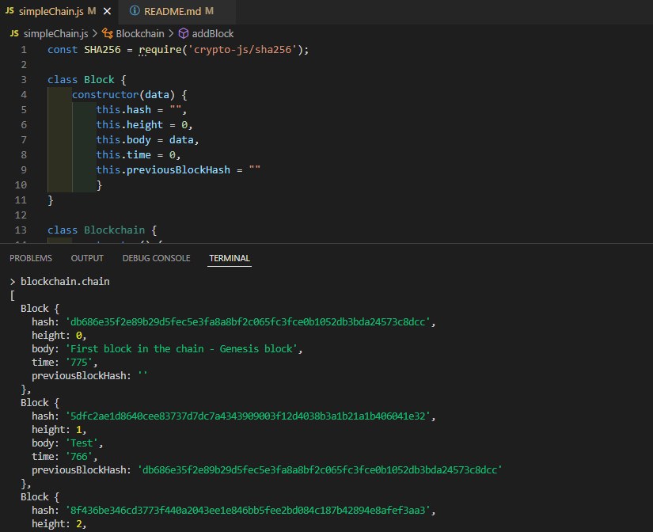

# Private-Blockchain-Project
Created a simple blockchain using resources from Udacity.

Able to create, store and link blocks with height and timestamp included. Hashed using SHA256.

    

## Technologies

- node.js 
- crypto.js.
